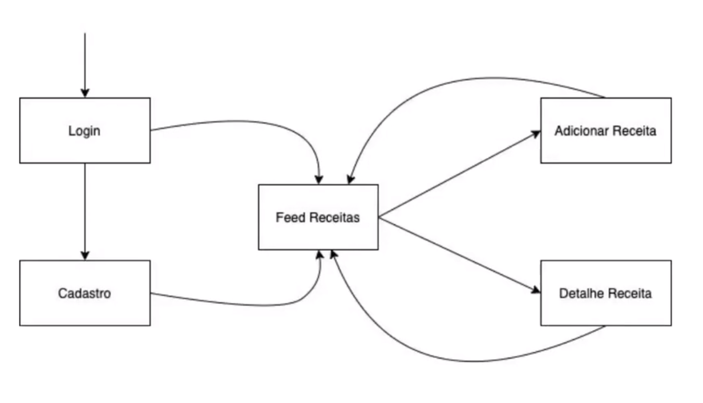
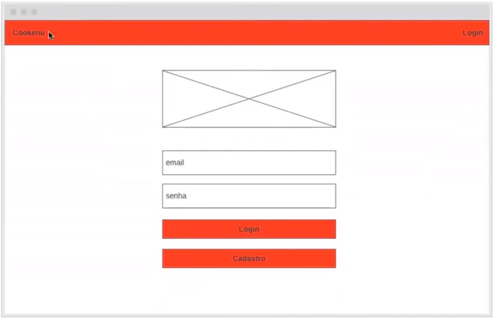
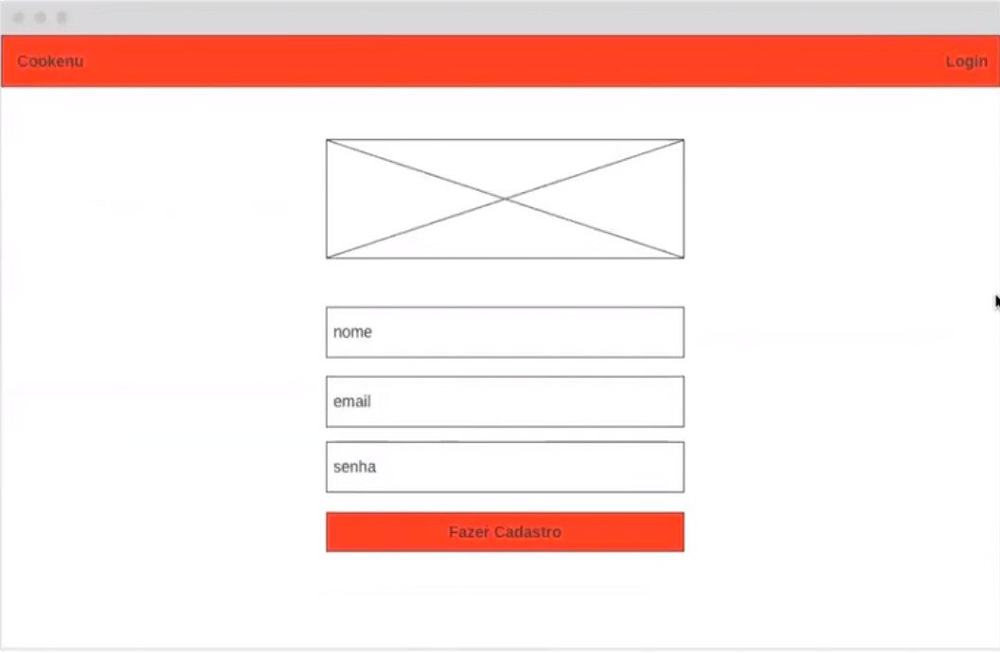
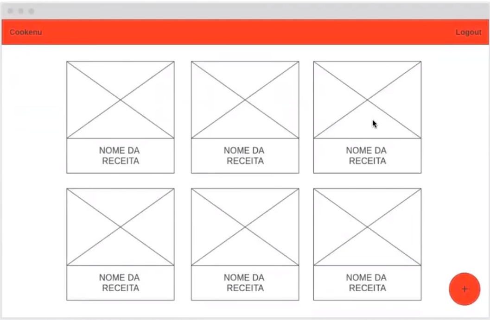
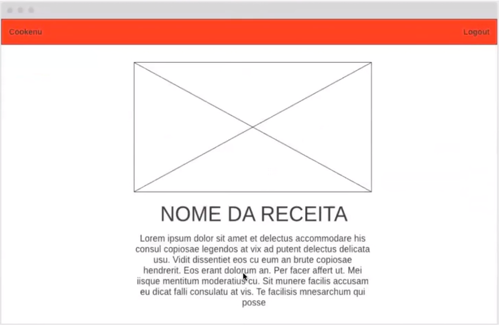
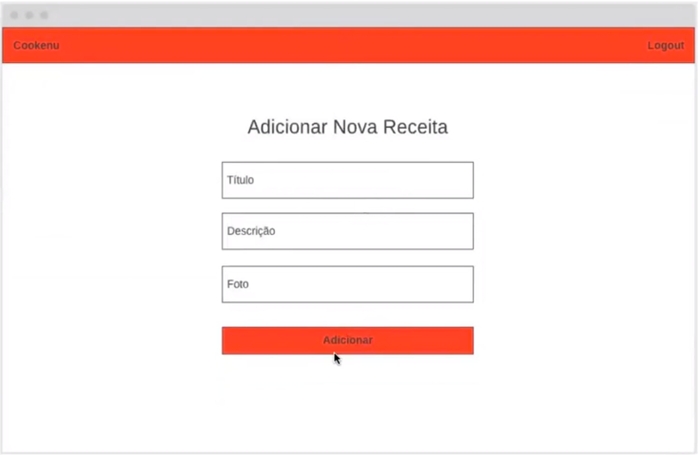

<h1 align="center">Cookenu</h1>

## Processo de Desenvolvimento

- [1. Link de Acesso](#Link-de-Acesso)
- [2. Resumo do Projeto](#1-resumo-do-projeto)
- [3. Instalação](#Instalação)
- [4. Iniciando](#Iniciando)
- [3. Fluxograma de Telas](#2-fluxograma-de-telas)
- [4. Wireframe de Telas](#3-wireframe-de-telas)
- [5. API utilizada](#4-api-utilizada)

## 1 Link de Acesso

Link surge: https://projeto-receita-api-accu.vercel.app/login

## 2. Resumo do Projeto

- Cookenu é um projeto de revisão do módulo de react com APIs, design systems e routes

- A aplicação consiste em um site de receitas com as seguintes telas:
  - Login
  - Cadastro
  - Lista de Receitas
  - Detalhes da Receita
  - Adicionar Receita

## 3. Instalação

- Node.js
- npm

Para instalar as dependências no diretório do seu projeto, execute o seguinte comando:

- npm install

## 4. Iniciando

Para iniciar o aplicativo, execute o seguinte comando:

- npm run start

## 5. Tecnologias e Ferramentas Utilizadas

Este site foi construído com as seguintes tecnologias:

- React
- React-Hooks
- React-Router-Dom
- JavaScript
- Styled-Components
- Chakra ui
- Axios
- API-Rest
- React-Toastify
- LocalStorage

## 2. Fluxograma de Telas

## 3. Wireframe de Telas

### Tela - Login:

### Tela - Cadastro:

### Tela - Lista de Receitas:

### Tela - Detalhes da Receita:

### Tela - Adicionar Receita:

## 4. API utilizada:

Clique [aqui](https://documenter.getpostman.com/view/21151478/2s8YzMZRju#intro) para ser direcionado para a documentação da API Cookenu utilizada no projeto

export const BASE_URL = 'https://api-cookenu.onrender.com';
